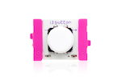

# Programming Little Bits circuits using JavaScript

By Anna Gerber

[Little Bits](http://littlebits.cc/) are modular electronic components that snap together via magnetic connectors. You can write programs to work with Little Bits circuits using the Little Bits Arduino At Heart module to read from input modules like buttons and dimmers, or to control output modules producing light, movement and sound. This tutorial will get you started with programming with Little Bits modules using JavaScript.

The tutorial projects are grouped by LittleBits kit so that you can find projects that will work with the bits that you have. At a minimum, you'll need an [Arduino at Heart module](http://littlebits.cc/bits/arduino), a [power](http://littlebits.cc/shop?filter=Power) module and at least one [input](http://littlebits.cc/shop?filter=Input) or [output](http://littlebits.cc/shop?filter=Output) module.

You can download all of the project files as a zip file [here](https://github.com/AnnaGerber/little-bits-js/archive/master.zip) or visit [AnnaGerber/little-bits-js](https://github.com/AnnaGerber/little-bits-js) on GitHub.

## Preparing your development environment

We'll be using the Node.js platform for running the JavaScript programs that we develop. You can download Node.js from [nodejs.org](http://nodejs.org/)

[Johnny-Five](https://github.com/rwaldron/johnny-five) is an Open Source Arduino programming framework for Node.js that we will use to communicate with the Little Bits Arduino At Heart Module. 

We'll be using the terminal (command line) to run our programs. On Mac open `/Applications/Utilities/Terminal.app` or on Windows, launch `Start > All Programs > Accessories > Command Prompt`.

We'll need to install the johnny-five framework using the Node Package Manager. Create a directory (e.g. little-bits-js) in your home directory to hold your programs, and then run the following commands via the terminal to change into that directory (cd) and install johnny-five:

    cd little-bits-js
    npm install johnny-five

Use your favourite text editor or JavaScript Integrated Development Environment (IDE) e.g. [Atom](https://atom.io/), [Sublime Text](http://www.sublimetext.com/), for creating and editing JavaScript files.

## Preparing the Arduino

Johnny-Five communicates with Arduino using the Firmata protocol, so you'll need to install Firmata on Arduino as a once-off step before you can start programming the board:

* Download the [Arduino IDE](http://arduino.cc/en/Main/Software) 
* Connect the Arduino module to the computer using USB
* The module does not get power via USB so you'll also need to connect a (blue) power module to the Arduino module to any of the 3 inputs on the Arduino module (d0, a0 or a1)
* Open the Arduino IDE and select 'Arduino Leonardo' under the Tools > Board menu
* Select the Serial port for your board under Tools > Serial Port. It will look something like /dev/tty.usb(...) on Mac, /dev/ttyUSB(...) on Linux or COM... on Windows.
* Open File > Examples > Firmata > StandardFirmata
* Click the 'Upload' button the send the Firmata program to the Arduino
* Wait until the status bar at the bottom of the Arduino IDE window says 'Done uploading' then close the Arduino IDE. Your Arduino is ready to go!

## Running your programs

You can run the JavaScript programs that you create using Node.js from the command line. For example to run the blink program from the first project, run the following from the directory where you have saved the blink.js JavaScript file:

    node blink.js

## Getting Started with the Arduino Coding Kit

### Bits you'll need

All of the bits for the _Getting Started_ projects can be found in the [Arduino Coding Kit ](http://littlebits.cc/kits/arduino-coding-kit) (previously known as Arduino Starter Bundle).

#### Wire (orange)

* 1 x [Arduino At Heart](http://littlebits.cc/bits/arduino)
* 1 x [fork](http://littlebits.cc/bits/fork)

#### Power (blue)

* 1 x [power](http://littlebits.cc/bits/littlebits-power)

For any of these projects, you can substitute an alternative power module like the [USB power module](http://littlebits.cc/bits/usb-power).

#### Inputs (pink)

* 1 x [button](http://littlebits.cc/bits/button)
* 2 x [dimmer](http://littlebits.cc/bits/dimmer)

#### Outputs (green)

* 1 x [bargraph](http://littlebits.cc/bits/bargraph)
* 1 x [servo](http://littlebits.cc/bits/servo)

### Projects

1. [Blink](./1.blink/instructions.md) Blink an LED
1. [Brightness](./2.brightness/instructions.md) Use a dimmer to control LED brightness
1. [Pulse](./3.pulse/instructions.md) Use a dimmer to create an LED pulsing effect
1. [Press](./4.press/instructions.md) Respond to button presses
1. [Sweep](./5.move/instructions.md) Sweep a servo 

## License

Copyright (c) 2014 Anna Gerber. Code licensed under the MIT license. Images and text licensed under CC-BY-SA.

## Credits

Images of bits used in this tutorial have been sourced from littlebits.cc and used under a Creative Commons CC-BY-SA license. Some of the project ideas were inspired by LittleBits [Arduino sketches] (http://littlebits.cc/arduino-sketches).