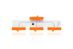
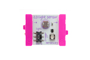
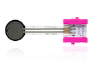

# Programming LittleBits with JavaScript

By Anna Gerber

[LittleBits](http://littlebits.cc/) are modular electronic components that snap together via magnetic connectors. You can write programs to work with LittleBits circuits using the Little Bits Arduino At Heart module to read from input modules like buttons and dimmers, or to control output modules producing light, movement and sound. This tutorial will get you started with programming with LittleBits modules using JavaScript.

The tutorial projects are organised by LittleBits kit so that you can find projects that will work with the bits that you have. At a minimum, you'll need an [Arduino At Heart module](http://littlebits.cc/bits/arduino), a [power](http://littlebits.cc/shop?filter=Power) module and at least one [input](http://littlebits.cc/shop?filter=Input) or [output](http://littlebits.cc/shop?filter=Output) module.

Projects by Kit:

 * [Arduino Coding Kit](#getting-started-with-the-arduino-coding-kit)
 * [Base Kit](#working-with-the-base-kit)
 * [Premium Kit](#working-with-the-premium-kit)
 * [Deluxe Kit](#working-with-the-deluxe-kit)
 <!--* [KORG Synth Kit](#making-sounds-with-the-korg-synth-kit)-->
 * [Space Kit](#reach-for-the-stars-with-the-space-kit)
 * [Hardware Development Kit](#inifinity-and-beyond-with-the-hardware-development-kit)

View a [list of all projects](#list-of-all-projects)

You can download all of the project files as a zip file [here](https://github.com/AnnaGerber/little-bits-js/archive/master.zip) or visit [AnnaGerber/little-bits-js](https://github.com/AnnaGerber/little-bits-js) on GitHub.

## Preparing your development environment

We'll be using the Node.js platform to run the JavaScript programs that we develop. You can download Node.js from [nodejs.org](http://nodejs.org/)

[Johnny-Five](https://github.com/rwaldron/johnny-five) is an Open Source Arduino programming framework for Node.js that we will use to communicate with the LittleBits Arduino At Heart Module. 

We'll be using the terminal (command line) to run our programs. On Mac open `/Applications/Utilities/Terminal.app` or on Windows, launch `Start > All Programs > Accessories > Command Prompt`.

We'll need to install the johnny-five framework using the Node Package Manager. Download the project files and extract to a directory (e.g. little-bits-js) in your home directory, and then run the following commands via the terminal to change into that directory (cd) and install johnny-five and other libraries required for all of the projects:

    cd little-bits-js
    npm install

Use your favourite text editor or JavaScript Integrated Development Environment (IDE) e.g. [Atom](https://atom.io/), [Sublime Text](http://www.sublimetext.com/), for editing JavaScript files.

## Preparing the Arduino

Johnny-Five communicates with Arduino using the Firmata protocol, so you'll need to install Firmata on Arduino as a once-off step before you can start programming the board:

* Download the [Arduino IDE](http://arduino.cc/en/Main/Software) 
* Connect the Arduino module to the computer using USB
* The module does not get power via USB so you'll also need to connect a (blue) power module to the Arduino module to any of the 3 inputs on the Arduino module (d0, a0 or a1)
* Open the Arduino IDE and select 'Arduino Leonardo' under the Tools > Board menu
* Select the Serial port for your board under Tools > Serial Port. It will look something like /dev/tty.usb(...) on Mac, /dev/ttyUSB(...) on Linux or COM... on Windows.
* Open File > Examples > Firmata > StandardFirmata
* Click the 'Upload' button the send the Firmata program to the Arduino
* Wait until the status bar at the bottom of the Arduino IDE window says 'Done uploading' then close the Arduino IDE. Your Arduino is ready to go!

## Running your programs

You can run the JavaScript programs that you create using Node.js from the command line. For example to run the blink program from the first project, run the following from your little-bits-js directory:

    node blink/blink.js

## Getting Started with the Arduino Coding Kit

These projects will get your started with programming LittleBits modules with JavaScript using the [Arduino Coding Kit](http://littlebits.cc/kits/arduino-coding-kit) (previously known as Arduino Starter Bundle).

1. [Blink](./blink/instructions.md) Blink an LED
1. [Brightness](./brightness/instructions.md) Use a dimmer to control LED brightness
1. [Pulse](./pulse/instructions.md) Use a dimmer to create an LED pulsing effect
1. [Press](./press/instructions.md) Respond to button presses
1. [Sweep](./sweep/instructions.md) Sweep a servo back and forth
1. [Turn](./turn/instructions.md) Turn a servo to specific positions
<!-- 1. [Draw](./draw/instructions.md) Use dimmers to draw like an Etch-a-sketch. -->

### Bits you'll need

All of the bits for the _Getting Started_ projects are included in the Arduino Coding Kit. 

#### Wire (orange)

* 1 x [Arduino At Heart](http://littlebits.cc/bits/arduino) (Used in all projects)
* 1 x [fork](http://littlebits.cc/bits/fork) <!-- (Used in [Draw](./draw/instructions.md)) -->

#### Power (blue)

* 1 x [power](http://littlebits.cc/bits/littlebits-power) (Used in all projects)

For any of these projects, you can substitute an alternative power module like the [USB power module](http://littlebits.cc/bits/usb-power).

#### Inputs (pink)

* 1 x [button](http://littlebits.cc/bits/button) (Used in [Press](./press/instructions.md))
* 2 x [dimmer](http://littlebits.cc/bits/dimmer) (Used in [Brightness](./brightness/instructions.md), [Pulse](./pulse/instructions.md)<!-- and [Draw](./draw/instructions.md)-->)

#### Outputs (green)

* 1 x [bargraph](http://littlebits.cc/bits/bargraph) (Used in [Blink](./blink/instructions.md) and [Brightness](./brightness/instructions.md))
* 1 x [servo](http://littlebits.cc/bits/servo) (Used in [Sweep](./sweep/instructions.md) and [Turn](./turn/instructions.md))

## Working with the Base Kit

If you have the [Base Kit](http://littlebits.cc/kits/base-kit) and an [Arduino At Heart](http://littlebits.cc/bits/arduino) module, you can try these projects:

1. [Blink](./blink/instructions.md) Blink an LED
1. [Brightness](./brightness/instructions.md) Use a dimmer to control LED brightness
1. [Pulse](./pulse/instructions.md) Use a dimmer to create an LED pulsing effect
1. [Press](./press/instructions.md) Respond to button presses or triggers
1. [Move](./move/instructions.md) Move a DC motor
1. [Sense](./sense/instructions.md) Read from an analog sensor
<!--- 1. [Buzz](./buzz/instructions.md) --->

### Bits you'll need

#### Wire (orange)

* 1 x [Arduino At Heart](http://littlebits.cc/bits/arduino) (Used in all projects)

#### Power (blue)

* 1 x [power](http://littlebits.cc/bits/littlebits-power) (Used in all projects)

#### Inputs (pink)

* 1 x [button](http://littlebits.cc/bits/button) (Used in [Press](./press/instructions.md))
* 1 x [dimmer](http://littlebits.cc/bits/dimmer) (Used in [Brightness](./brightness/instructions.md) and [Pulse](./pulse/instructions.md))
* 1 x [light-sensor](http://littlebits.cc/bits/light-sensor) (Can be used in [Sense](./sense/instructions.md))

#### Outputs (green)

<!-- -->

* 1 x [bargraph](http://littlebits.cc/bits/bargraph) (Used in [Blink](./blink/instructions.md) and [Brightness](./brightness/instructions.md))
* 1 x [bright-led](http://littlebits.cc/bits/bright-led) (Can be used in [Blink](./blink/instructions.md) and [Brightness](./brightness/instructions.md))
* 1 x [dc-motor](http://littlebits.cc/bits/dc-motor) (Used in [Move](./move/instructions.md))
<!-- * 1 x [buzzer](http://littlebits.cc/bits/buzzer) (Used in [Buzz](./buzz/instructions.md)) -->

## Working with the Premium Kit

The bits for these projects can be found in the [Premium Kit](http://littlebits.cc/kits/premium-kit). As always, you'll also need an [Arduino At Heart](http://littlebits.cc/bits/arduino) module.

1. [Blink](./blink/instructions.md) Blink an LED
1. [Brightness](./brightness/instructions.md) Use a dimmer to control LED brightness
1. [Press](./press/instructions.md) Respond to button presses
1. [Pulse](./pulse/instructions.md) Use a dimmer to create an LED pulsing effect
1. [Sweep](./sweep/instructions.md) Sweep a servo back and forth
1. [Turn](./turn/instructions.md) Turn a servo to specific positions
1. [Move](./move/instructions.md) Move a DC motor
1. [Sense](./sense/instructions.md) Read from an analog sensor

### Bits you'll need

#### Wire (orange)

* 1 x [Arduino At Heart](http://littlebits.cc/bits/arduino) (Used in all projects)
* 1 x [branch](http://littlebits.cc/bits/branch) (Optionally used in [Sense](./sense/instructions.md))
* 2 x [wire](http://littlebits.cc/bits/wire-bit) (Optionally used in [Sense](./sense/instructions.md))

#### Power (blue)

* 1 x [power](http://littlebits.cc/bits/littlebits-power) (Used in all projects)

#### Inputs (pink)

* 1 x [slide-dimmer](http://littlebits.cc/bits/slide-dimmer) (Can be used in [Brightness](./brightness/instructions.md) and [Pulse](./pulse/instructions.md))
* 1 x [roller-switch](http://littlebits.cc/bits/roller-switch) (Can be used in [Press](./press/instructions.md))
* 1 x [pressure-sensor](http://littlebits.cc/bits/pressure-sensor) (Can be used in [Sense](./sense/instructions.md))
* 1 x [sound-trigger](http://littlebits.cc/bits/sound-trigger) (Can be used in [Press](./press/instructions.md))

#### Outputs (green)

* 1 x [long-led](http://littlebits.cc/bits/long-led) (Can be used in [Blink](./blink/instructions.md) and [Brightness](./brightness/instructions.md))
* 1 x [servo](http://littlebits.cc/bits/servo) (Used in [Sweep](./sweep/instructions.md) and [Turn](./turn/instructions.md))
* 1 x [vibration-motor](http://littlebits.cc/bits/vibration-motor) (Can be used in [Move](./move/instructions.md))
* 1 x [fan](http://littlebits.cc/bits/fan) (Can be used in [Move](./move/instructions.md))

## Working with the Deluxe Kit

You can make these projects with the [Deluxe Kit](http://littlebits.cc/kits/deluxe-kit) plus an [Arduino At Heart](http://littlebits.cc/bits/arduino) module.

1. [Press](./press/instructions.md) Respond to button presses
1. [Sweep](./sweep/instructions.md) Sweep a servo back and forth
1. [Turn](./turn/instructions.md) Turn a servo to specific positions
1. [Move](./move/instructions.md) Move a DC motor
1. [Sense](./sense/instructions.md) Read from an analog sensor

### Bits you'll need

#### Wire (orange)

* 1 x [Arduino At Heart](http://littlebits.cc/bits/arduino) (Used in all projects)
* 1 x [fork](http://littlebits.cc/bits/branch) (Optionally used in [Sense](./sense/instructions.md))
* 2 x [wire](http://littlebits.cc/bits/wire-bit) (Optionally used in [Sense](./sense/instructions.md))

#### Power (blue)

* 1 x [power](http://littlebits.cc/bits/littlebits-power) (Used in all projects)

#### Inputs (pink)

* 1 x [button](http://littlebits.cc/bits/button) (Used in [Press](./press/instructions.md))
* 1 x [slide-dimmer](http://littlebits.cc/bits/slide-dimmer) (Can be used in [Sense](./sense/instructions.md))
* 1 x [sound-trigger](http://littlebits.cc/bits/sound-trigger) (Can be used in [Press](./press/instructions.md))

#### Outputs (green)

* 1 x [servo](http://littlebits.cc/bits/servo) (Used in [Sweep](./sweep/instructions.md) and [Turn](./turn/instructions.md))
* 1 x [dc-motor](http://littlebits.cc/bits/dc-motor) (Used in [Move](./move/instructions.md))

<!--
## Making Sounds with the KORG Synth Kit

Combine the [Arduino At Heart](http://littlebits.cc/bits/arduino) module with the [Synth Kit](http://littlebits.cc/kits/synth-kit) and you'll be making amazing sounds in no time!

### Bits you'll need

#### Wire (orange)

* 1 x [Arduino At Heart](http://littlebits.cc/bits/arduino) (Used in all projects)

#### Power (blue)

* 1 x [power](http://littlebits.cc/bits/littlebits-power) (Used in all projects)

#### Inputs (pink)

#### Outputs (green)

* 1 x [speaker](http://littlebits.cc/bits/speaker) (Used in [Sound](./sound/instructions.md))

-->

## Reach for the stars with the Space Kit

You can build these projects with bits from the [Space Kit](http://littlebits.cc/kits/space-kit) plus [Arduino At Heart](http://littlebits.cc/bits/arduino).

1. [Blink](./blink/instructions.md) Blink an LED
1. [Press](./press/instructions.md) Respond to button presses or triggers
1. [Sweep](./sweep/instructions.md) Sweep a servo back and forth
1. [Turn](./turn/instructions.md) Turn a servo to specific positions
1. [Move](./move/instructions.md) Move a DC motor
1. [Sense](./sense/instructions.md) Read from an analog sensor

### Bits you'll need

#### Wire (orange)

* 1 x [Arduino At Heart](http://littlebits.cc/bits/arduino) (Used in all projects)

#### Power (blue)

* 1 x [power](http://littlebits.cc/bits/littlebits-power) (Used in all projects)

#### Inputs (pink)

* 1 x [light-sensor](http://littlebits.cc/bits/light-sensor) (Can be used in [Sense](./sense/instructions.md))
* 1 x [remote-trigger](http://littlebits.cc/bits/remote-trigger) (Can be used in [Press](./press/instructions.md))
#### Outputs (green)

<!---->

* 1 x [bright-led](http://littlebits.cc/bits/bright-led) (Can be used in [Blink](./blink/instructions.md))
* 1 x [ir-led](http://littlebits.cc/bits/ir-led) (Can be used in [Blink](./blink/instructions.md))
* 1 x [dc-motor](http://littlebits.cc/bits/dc-motor) (Used in [Move](./move/instructions.md))
<!--* 1 x [speaker](http://littlebits.cc/bits/speaker) (Used in [Sound](./sound/instructions.md))-->

## Infinity and Beyond with the Hardware Development Kit

Build and program your own bits!

1. [Proto Input](./proto-in/instructions.md) Program your own input module
<!--- 1. [Proto Output](./proto-out/instructions.md) Program your own output module --->

### Bits you'll need

#### Wire (orange)

* 1 x [Arduino At Heart](http://littlebits.cc/bits/arduino) (Used in all projects)
* 1 x [Proto Module](http://littlebits.cc/bits/proto) (Used in [Proto Input](./proto-in/instructions.md))

#### Power (blue)

 

* 1 x [power](http://littlebits.cc/bits/littlebits-power) (Used in all projects)

## List of All Projects

1. [Blink](./blink/instructions.md) Blink an LED
1. [Brightness](./brightness/instructions.md) Use a dimmer to control LED brightness
1. [Pulse](./pulse/instructions.md) Use a dimmer to create an LED pulsing effect
1. [Press](./press/instructions.md) Respond to button presses
1. [Sweep](./sweep/instructions.md) Sweep a servo back and forth
1. [Turn](./turn/instructions.md) Turn a servo to specific positions
1. [Move](./move/instructions.md) Move a DC motor
1. [Sense](./sense/instructions.md) Read from an analog sensor
1. [Proto Input](./proto-in/instructions.md) Program your own input module
<!-- 1. [Sound](./sound/instructions.md) Make sound with a speaker -->
<!-- 1. [Draw](./draw/instructions.md) Use dimmers to draw like an Etch-a-sketch.-->
<!--- 1. [Proto Output](./proto-out/instructions.md) Program your own output module --->
<!--- 1. [Buzz](./buzz/instructions.md) --->

More projects coming soon!

If you liked this tutorial you might also like [node-ardx](http://node-ardx.org/).

## License

Copyright (c) 2014 Anna Gerber. Code licensed under the MIT license. Images and text licensed under CC-BY-SA.

## Credits

Images of bits used in this tutorial have been sourced from [littlebits.cc](http://littlebits.cc) and used under a Creative Commons CC-BY-SA license. Some of the project ideas were inspired by LittleBits [Arduino sketches](http://littlebits.cc/arduino-sketches).