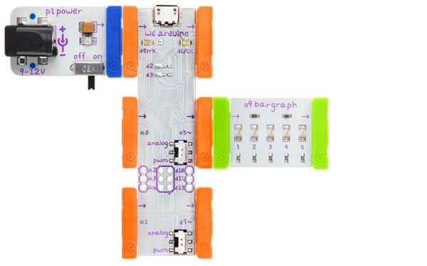

## Blink

Blink an LED

### Bits you'll need

* 1 x [Arduino](http://littlebits.cc/bits/arduino)
* 1 x [power](http://littlebits.cc/bits/littlebits-power)
* 1 x [bargraph](http://littlebits.cc/bits/bargraph) 


If you don't have a bargraph, use an alternative LED bit instead e.g. [LED](http://littlebits.cc/bits/led), [Long LED](http://littlebits.cc/bits/long-led) or [Bright LED](http://littlebits.cc/bits/bright-led).

### Assembling the circuit

Connect power bit to d0 on Arduino bit, d5 on Arduino bit to bargraph (or LED) bit.



### Code

```javascript
var five = require("johnny-five"), board, led;

board = new five.Board();

board.on("ready", function() {
  led = new five.Led(5);
  led.strobe( 1000 );
  this.repl.inject({
    led: led
  });
});
```
You can find a copy of this code in [blink/blink.js](./blink.js)

Notice how we have included the johnny-five framework using a require statement at the start of our program:

```javascript
var five = require("johnny-five")
```

We can access the framework using the `five` variable throughout our program. We've also declared other variables that we will use (board and led) at the start of our program.

In all of our programs, we'll first create a board object to correspond to our Arduino, and then wait for the board to be ready before we start working with our input and output modules:

```javascript
board = new five.Board();

board.on("ready", function() {
  // code to work with inputs and outputs goes here
  // it will run only after the board has started up and is ready to go
});
```

Run the code from the terminal e.g.

    node blink/blink.js


### What you'll see

A Light Emitting Diode (LED) converts electrical energy into light. We've created an Led object to control our LED module attached to pin 5. 

```javascript
led = new five.Led(5);
```

The `strobe` method blinks the LED module on and off by varying the signal on the I/O pin to which the LED is connected between on (5V) and off. We specify the blink delay in milliseconds as a parameter:

```javascript
led.strobe( 1000 );
```

All of the LEDs in the bargraph will blink on and off together, once per second (1000 milliseconds).

### What to try

Johnny-Five provides a REPL (Read-Eval-Print Loop) where you can type in commands to take effect immediately. So that we can control our LED module interactively, we inject our led object into the REPL:

```javascript
this.repl.inject({
    led: led
});
```

From the REPL prompt try the following commands:

    led.stop()    // stop blinking or pulsing
    led.off()     // turn led off
    led.on()      // turn led on
    led.pulse()   // pulse the led
    led.fadeIn()  // fade to full brightness
    led.fadeOut() // fade to off

Hit control plus d on a new line in the REPL to exit and terminate the program.
