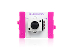
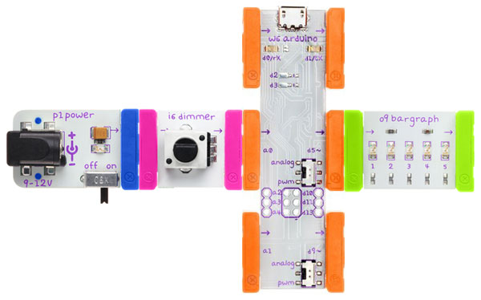

## Brightness

Use a dimmer to control LED brightness

### Bits you'll need

 * 1 x [Arduino](http://littlebits.cc/bits/arduino)
 * 1 x [power](http://littlebits.cc/bits/littlebits-power)
 * 1 x [dimmer](http://littlebits.cc/bits/dimmer)
 * 1 x [bargraph](http://littlebits.cc/bits/bargraph)





If you don't have a bargraph, use an alternative LED bit instead e.g. [LED](http://littlebits.cc/bits/led), [Long LED](http://littlebits.cc/bits/long-led) or [Bright LED](http://littlebits.cc/bits/bright-led).

If you don't have a dimmer, you can use a [slide-dimmer](http://littlebits.cc/bits/slide-dimmer) instead.

### Assembling the circuit

Connect power bit to dimmer bit, dimmer bit to a0 on Arduino bit, d5 on Arduino bit to bargraph bit. Switch the output mode for d5 on the Arduino to PWM using the onboard switch next to the connector.



### Code

```javascript
var five = require("johnny-five"),
  board, led, dimmer;

board = new five.Board();

board.on("ready", function() {
  
  led = new five.Led(5);

  dimmer = new five.Sensor({
    pin: "A0",
    freq: 250
  });
  
  led.on();

  dimmer.on("change", function() {
    // raw value read will be between 0 and 1023
    console.log("dimmer reading " + this.raw);
    // brightness expects a value up to 255, so divide by 4
    led.brightness(Math.floor(this.raw / 4));
  });

});
```
You can find a copy of this code in [brightness/brightness.js](./brightness.js)

Run the code from the terminal e.g.

    node brightness/brightness.js

### What you'll see

The `change` event is triggered whenever the dimmer value changes. We have attached an anonymous event handler function that will run whenever the event is triggered. 

All of the LEDs in the bargraph will increase or decrease in brightness in response to twisting the dimmer.  You'll also see the raw value read from the dimmer printed to the console whenever the value changes.

### What to try

This project uses Pulse Width Modulation (PWM) to control the LED brightness using a value read from an analog input (the dimmer). 

The brightness method takes a value between 0 and 255. Try injecting the led into the REPL and setting the brightness directly: 

```javascript
led.brightness(255) // maximum brightness
```

Try switching d5 to analog mode instead of PWM. Now, as the strengh of the signal to the bargraph increases, more LEDs in the bargraph will turn on.

What's going on? The signals that we send and receive on the I/O pins are either discrete _digital_ values (high (5V) or low (0)), or _analog_ (any voltage value in a continuous range between 0 and 5). PWM is used to simulate an analog signal on a digital pin by alternating between high and low signal for different durations in cycles, with the average value of the highs and lows across each cycle representing the simulated analog value. When we switch pin d5 to analog mode, the PWM signal that we are sending to pin 5 gets passed through a low pass filter that takes the average voltage and outputs a continuous analog signal. This is a unique feature of the LittleBits Arduino at Heart module. The bargraph responds differently to the PWM vs analog signal.

Note: we can use the Sensor class to read from any input module. We have specified our dimmer pin as the string "A0" - the "A" indicates that it is an analog rather than digital pin, while our led pin is digital and is specified as a number.