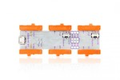
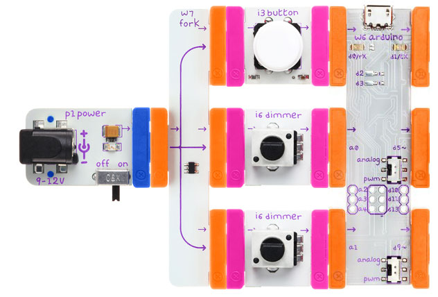

## Draw

Use dimmers to draw to the screen just like an Etch-a-sketch.

### Bits you'll need

* 1 x [Arduino](http://littlebits.cc/bits/arduino)
* 1 x [power](http://littlebits.cc/bits/littlebits-power)
* 1 x [fork](http://littlebits.cc/bits/fork)
* 2 x [dimmers](http://littlebits.cc/bits/dimmer)




### Assembling the circuit

Connect power bit to fork bit, fork to dimmers, one dimmer to a0 on Arduino, the other dimmer to a1 on Arduino.



### Code

We'll be building a web interface for our Etch-a-Sketch. First, we'll create a web server using Node.js that will read the X and Y values from the dimmers and communicate them to our client (that runs in the webrowser).

```javascript
var five = require("johnny-five"), 
  http = require('http'),
  io = require('socket.io'),
  io = require('socket.io'),
  fs = require('fs'),
  board, joystick,
  html, server;

board = new five.Board();

board.on("ready", function() {

  // create a "joystick" using the dimmers on A1 and A0
  joystick = new five.Joystick({
    pins: ["A1", "A0"],
    freq: 100
  });

  // load our draw.html page from file
  html = fs.readFileSync('draw.html').toString();

  // create web server 
  server = http.createServer(function (req, res) { 
    res.writeHead(200, {'Content-Type': 'text/html'});
    res.end(html);
  });

  io.listen(server).on('connection', function (socket) {
    
    // send the X, Y values to the client
    joystick.on("axismove", function(err, timestamp) {
      console.log(this.fixed.x, this.fixed.y);
      socket.emit('drawing', this.fixed);
    });

  });
  // run web server on http://localhost:3000
  server.listen(3000);
});
```

You can find a copy of this code in [draw/draw.js](./draw.js)

The client (front-end) code is in [draw/draw.html](./draw.html).

```javascript
var socket = io('http://localhost:3000'),
  context = $('#canvas')[0].getContext('2d'),
  prev;

context.strokeStyle='blue';

$('#clear').click(function(){
  context.clearRect(0,0,600,400);
  context.beginPath();
});

socket.on('drawing', function (data) {
  $('#status').html('Connected (x: ' + data.x + ', y: ' + data.y + ')');
  // scale values to match canvas size
  data.x *= 600;
  data.y *= 400;
  // if values have changed, draw a line to the new position
  if (prev && (prev.x != data.x || prev.y != data.y)) {
    context.moveTo(prev.x, prev.y);
    context.lineTo(data.x, data.y);
    context.stroke();    
  }
  prev = data;
});

socket.on('disconnect', function() {
  $('#status').html('Disconnected');
});
```

Run the server code from the terminal e.g.

    node draw/draw.js

Then visit http://localhost:3000 in a standards-compliant web browser (e.g. Google Chrome or Firefox).

### What you'll see

When you move the dimmers, you'll leave a line on the screen like an Etch-a-Sketch. The clear button resets the drawing.

The joystick object tracks our X and Y values from the two dimmers. We could have used the Sensor class like we did in [Brightness](../brightness/instructions.md), to read values from both dimmers, however the Joystick `axismove` event will regularly update us with the value of both X and Y together, which is convenient for this application.

We're using socket.io to communicate between our server and client. Whenever we get a new reading from the joystick object, we send it to the client using `socket.emit()`.

The client listens for the _'drawing'_ message from the server, and if the X and Y values have changed since the last message, it uses the HTML5 canvas to draw a line matching the values from the dimmers.

### What to try

Socket.io makes it easy to communicate data that we read from littleBits input modules in our Node.js programs to web clients. Read more about [socket.io](http://socket.io/docs/).

You can change the color and weight of the lines that we are drawing by setting HTML5 canvas line properties. Read more about styling lines [here](https://developer.mozilla.org/en-US/docs/Web/API/Canvas_API/Tutorial/Applying_styles_and_colors#Line_styles)
