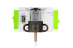
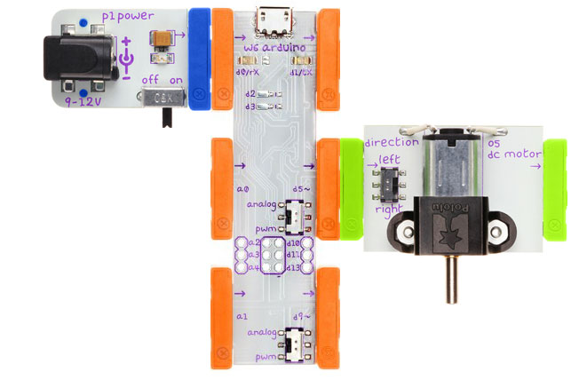

## Move

Move a DC motor

### Bits you'll need

* 1 x [Arduino](http://littlebits.cc/bits/arduino)
* 1 x [power](http://littlebits.cc/bits/littlebits-power)
* 1 x [dc-motor](http://littlebits.cc/bits/dc-motor)





### Assembling the circuit

Connect power bit to d0 on Arduino bit, d5 on Arduino bit to dc-motor bit. Flick the switch next to d5 to _pwm_. 



You might also like to use a [wire](http://littlebits.cc/bits/wire-bit) between d5 and the dc-motor to give you more flexibility to position the motor, or a [motor-mate](http://littlebits.cc/accessories/motormate) to attach some paper to the motor so you can see it moving more easily.


### Code

```javascript
var five = require("johnny-five"), 
  board, motor;

board = new five.Board();

board.on("ready", function() {

  var motor = new five.Motor(5);

  motor.start();
  
  board.wait(5000, function() {
      motor.stop();
  });

  this.repl.inject({
    motor: motor
  });
});
```

WARNING: I expect that this code should work but it has not been tested because I don't have a DC motor module yet.

You can find a copy of this code in [move/move.js](./move.js)

Run the code from the terminal e.g.

    node move/move.js

### What you'll see

The motor will spin for 5 seconds and then stop. 

The board object's `wait` method can be used to shedule something to happen. The first parameter is the delay in milliseconds, and the second is a function specifying what to do after waiting for the specified time. 

### What to try

Flicking the switch on the dc-motor module will switch the direction the motor is spinning.

Use the REPL to start or stop the motor:

    motor.start() 
    motor.stop()  
    motor.isOn    // property indicates whether it is moving

You can also control the motor speed:

    motor.speed(50)  // slow
    motor.speed(120) // mid-speed
    motor.speed(255) // full speed
