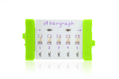

## Press

Respond to button presses

### Bits you'll need

 * 1 x [Arduino](http://littlebits.cc/bits/arduino)
 * 1 x [power](http://littlebits.cc/bits/littlebits-power)
 * 1 x [button](http://littlebits.cc/bits/button)
 * 1 x [bargraph](http://littlebits.cc/bits/bargraph)




### Assembling the circuit

Connect power bit to button bit, button bit to d0 on Arduino bit, d5 on Arduino bit to bargraph bit.


### Code

```javascript
var five = require("johnny-five"), 
  board, led, button,
  buttonCounter = 0;

board = new five.Board();

board.on("ready", function() {
  led = new five.Led(5);
  button = new five.Button(0);

  button.on("press", function(value){
    buttonCounter++;
    if (buttonCounter % 2 === 0) {
      led.off();
    } else {
      led.on();
    }
    console.log("button has been pressed " + buttonCounter + " times");
  });
});
```

You can find a copy of this code in [press/press.js](./press.js)

Run the code from the terminal e.g.

    node press/press.js

### What you'll see

When you press the button, the bargraph will toggle between on and off. The count of how many times the button has been pressed will be printed to the console.

### What to try

The modulo operator (%) is used to check whether the number of button presses is divisible by 2 to determine what action to perform on each press. You can add more actions to cycle through by increasing this value and adding additional `else if` statements e.g.

    if (buttonCounter % 3 === 0) {
      // led off
      led.off();
    } else if (buttonCounter % 3 === 1) {
      // drop to half brightness
      led.brightness(128);
    } else {
      // led on
      led.on();
    }