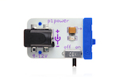
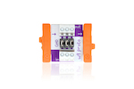

## Proto Input

Program your own input module

### Bits you'll need

* 1 x [Arduino](http://littlebits.cc/bits/arduino)
* 1 x [power](http://littlebits.cc/bits/littlebits-power)
* 1 x [proto](http://littlebits.cc/bits/proto) 





You'l also need a sensor component to connect to the proto module. We'll connect a TMP36 temperature sensor to create a custom input module, but you could use almost any Arduino-compatible 5V analog sensor.

### Assembling the circuit

Connect power bit to proto bit, proto bit to A0 on the Arduino.


Remove the middle jumper pin from the proto module. 

Connect the ground pin of the sensor to the left-most terminal in the top set of screw terminals, signal to the middle terminal and VCC to the right-most terminal.


### Code

```javascript
var five = require("johnny-five"), board, sensor;

board = new five.Board();

board.on("ready", function() {
  sensor = new five.Sensor({
    pin: "A0",
    freq: 500
  });
  sensor.on("data", function(err, value){
    // convert raw reading to celcius
    var cel = ((value * 0.004882814) - 0.5) * 100;
    console.log("temperature in celcius: " + cel);
  });
});
```
You can find a copy of this code in [proto-in/proto-in.js](./proto-in.js)

Run the code from the terminal e.g.

    node proto-in/proto-in.js

### What you'll see

Twice a second, the temperature will be printed to the console.

If your temperature readings are off the scale, you've probably connected your TMP36 sensor component backwards. Disconnect the proto module from the power, and wait a minute or two before reversing the sensor as it will be hot to touch and you may burn your fingers! (The author learnt this the hard way)

### What to try

You can add a conditional statement to trigger other behaviour when the input value reaches a threshold, for example, to control a fan on pin d5 when the temperature gets warm:

```javascript
var five = require("johnny-five"), 
  board, sensor, fan;

board = new five.Board();

board.on("ready", function() {
  sensor = new five.Sensor({
    pin: "A0",
    freq: 500
  });
  fan = new five.Motor(5);
  sensor.on("data", function(err, value){
    // convert raw reading to celcius
    var cel = ((value * 0.004882814) - 0.5) * 100;
    console.log("temperature in celcius: " + cel);
    if (cel > 25) {
      fan.start();
    } else {
      fan.stop();
    }
  });
});
```

There are a lot of analog sensor components that have a ground, signal and 5V pin. Now you can connect them with your LittleBits circuits and write programs to read from them using the johnny-five Sensor class.

Read more tips and tricks for working with the proto module at [littlebits.cc](http://littlebits.cc/hdk-tips-tricks)