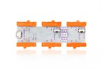
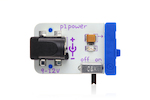
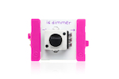
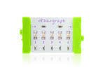
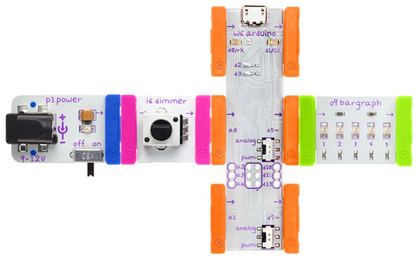

## Pulse

Use a dimmer to create an LED pulsing effect

### Bits you'll need

 * 1 x [Arduino](http://littlebits.cc/bits/arduino)
 * 1 x [power](http://littlebits.cc/bits/littlebits-power)
 * 1 x [dimmer](http://littlebits.cc/bits/dimmer)
 * 1 x [bargraph](http://littlebits.cc/bits/bargraph)






### Assembling the circuit

Connect power bit to dimmer bit, dimmer bit to a0 on Arduino bit, d5 on Arduino bit to bargraph bit. Switch the output mode for d5 to PWM.



### Code

```javascript
var five = require("johnny-five"), 
  board, led, dimmer;

board = new five.Board();

board.on("ready", function() {
  led = new five.Led(5);
  dimmer = new five.Sensor({
    pin: "A0",
    freq: 250
  });

  dimmer.on("change", function() {
    console.log("dimmer reading " + this.raw);
    // as dimmer value increases, the pulse duration will approach 0
    led.pulse(1023 - this.raw);
  });
});
```

You can find a copy of this code in [pulse/pulse.js](./pulse.js)

Run the code from the terminal e.g.

    node pulse/pulse.js

### What you'll see

As you turn the dimmer clockwise, the speed at which the LEDs in the bargraph pulse will increase. The raw value read from the dimmer will be printed to the console. 

The `pulse` method takes a parameter that indicates the duration of each pulse in milliseconds. The led will continue to pulse indefinitely after `pulse` has been called. You can use the `stop` method to stop the led from pulsing.

### What to try

We've inverted the reading from the dimmer by subtracting the raw value from 1023 (the maximum possible value) so that the pulse speed will increase as we turn the dimmer clockwise.  Experiment with changing the formula for calculating the pulse duration to change this behaviour and the speed of the pulses.
