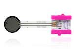
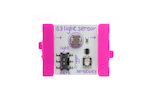
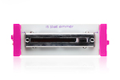
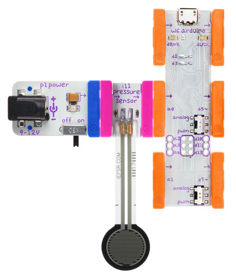
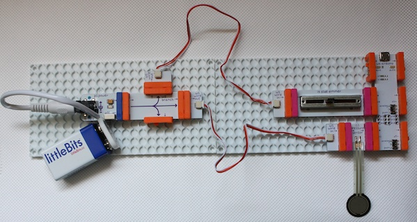

## Sense

Read from analog sensors / inputs

### Bits you'll need

 * 1 x [Arduino](http://littlebits.cc/bits/arduino)
 * 1 x [power](http://littlebits.cc/bits/littlebits-power)

 Plus any analog input bit e.g. [pressure-sensor](http://littlebits.cc/bits/pressure-sensor), [light-sensor](http://littlebits.cc/bits/light-sensor), [slide-dimmer](http://littlebits.cc/bits/slide-dimmer), [dimmer](http://littlebits.cc/bits/dimmer).







### Assembling the circuit

Connect power bit to sensor bit, input bit to a0 on Arduino bit.



### Code

```javascript
var five = require("johnny-five"),
  board, sensor;

board = new five.Board();

board.on("ready", function() {
  
  sensor = new five.Sensor({
    pin: "A0",
    freq: 250
  });
  sensor.on("data", function() {
    console.log("sensor reading " + this.raw);
  });
});
```

You can find a copy of this code in [sense/sense.js](./sense.js)

Run the code from the terminal e.g.

    node sense/sense.js

### What you'll see

The `data` event is triggered whenever the sensor is polled, and our handler prints the raw sensor value to to the console. The raw value will be between 0 and 1023.

### What to try

You can change the frequency of the data event by modifying the freq option in the Sensor constructor. The value is specified in milliseconds, e.g. to get a sensor reading every 2 seconds, change the frequency to 2000:

```javascript
sensor = new five.Sensor({
  pin: "A0",
  freq: 2000
});
```

You can attach multiple input modules, for example, to attach inputs on both A0 and A1, you'll need to use a fork bit or branch plus wires to connect the power bit to both of the input modules.



If you only want something to happen when the sensor event actually changes, listen for the "change" event rather than the "data" event. The sensor value will be checked periodically according to the freq option in the constructor, but your handler function will only be triggered if the sensor value has changed.

Create a second sensor object and change handler for your second sensor:

```javascript
sensor2 = new five.Sensor({
  pin: "A1",
  freq: 1000
});
sensor2.on("change", function() {
  console.log("sensor2 reading " + this.raw);
});
```
