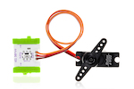
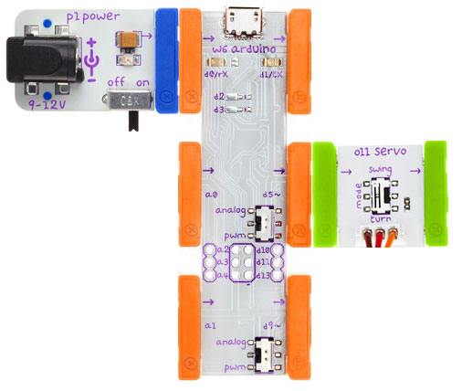

## Turn

Turn a servo

### Bits you'll need

* 1 x [Arduino](http://littlebits.cc/bits/arduino)
* 1 x [power](http://littlebits.cc/bits/littlebits-power)
* 1 x [servo](http://littlebits.cc/bits/servo)





### Assembling the circuit

Connect power bit to d0 on Arduino bit, d5 on Arduino bit to servo bit. Flick the switch next to d5 to _analog_ and the switch on the servo module to _turn_.



### Code

```javascript
var five = require("johnny-five"), 
  board, servo;

board = new five.Board();

board.on("ready", function() {
  this.pinMode(5,five.Pin.PWM);
  this.analogWrite(5, 0); // move to min
  this.repl.inject({
    board: board
  });

});
```

You can find a copy of this code in [turn/turn.js](./turn.js)

Run the code from the terminal e.g.

    node turn/turn.js

### What you'll see

This project shows how we can write directly to pins via the board object.

This direct method of writing to the pins works with any output modules that accept analog input.

In this case, the value sent will control the servo position. We are setting a value of 0, so the servo will move to its minimum position initially.


### What to try

In the REPL, use `board.analogWrite(pin, value)` to set the position of the servo:

    board.analogWrite(5, 120) // set position roughly to mid point
    board.analogWrite(5, 240) // move towards max position
  
The first parameter is the pin (in this case digital pin 5) and the second is the value to write. When you send a value of 255, the servo will move to the maximum position, and sending 0 will move it to the minimum position.

Note: If your servo is shuddering when you set the value to 255, try a slightly smaller value e.g. 240. If it is shuddering even at mid-point positions, make sure you have the switch next to the d5 pin set to _analog_. 